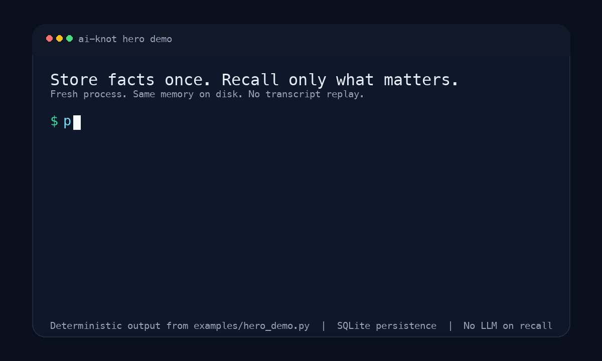

<div align="center">

# 🪢 ai-knot

### Long-term memory for AI agents — structured, self-hosted, deterministic.

Your agent forgets everything between sessions. The usual fix — replaying the whole
conversation history into every prompt — is slow, expensive, and gets worse every day.
**ai-knot remembers _facts_, not transcripts:** it distills conversations into a handful
of structured facts and hands your agent only the 3–5 it needs for the next turn.
No LLM on the retrieval path. No cloud. No lock-in.

[](https://github.com/alsoleg89/ai-knot/actions/workflows/ci.yml)
[](https://pypi.org/project/ai-knot/)
[](https://www.npmjs.com/package/ai-knot)


[**Quickstart**](#quickstart-30-seconds) · [**Open in Codespaces**](https://codespaces.new/alsoleg89/ai-knot) · [**Surface snippets**](#what-it-looks-like-in-your-stack) · [**Integrations**](docs/integrations.md) · [**Why ai-knot**](#why-ai-knot) · [**Use cases**](#what-you-can-build) · [**Benchmarks**](docs/benchmarks.md) · [**Docs**](docs/usage.md)



</div>

---

## See it work

```python
from ai_knot import KnowledgeBase

kb = KnowledgeBase(agent_id="assistant")   # persists to disk — survives restarts

kb.add("User is a senior backend developer at Acme Corp")
kb.add("User writes Go and avoids Java")
kb.add("User deploys services with Docker and Kubernetes")
kb.add("Team standup is at 10am")

# At inference time, pull ONLY what this turn needs — no LLM call, ~8 ms:
print(kb.search("what language and tooling does the user use?"))  # alias: kb.recall(...)
# [1] User writes Go and avoids Java
# [2] User deploys services with Docker and Kubernetes
# [3] User is a senior backend developer at Acme Corp
```

It surfaced the three relevant facts and left the standup noise behind — deterministically,
with no model call, no embedding round-trip, in single-digit milliseconds. Re-run it tomorrow
in a fresh process and you get the same answer.

---

## The problem

Most agent frameworks treat memory as a **log**: store every message, replay it all, and
pay to inject six months of history into a prompt that needs three sentences of it.

```
❌  log-as-memory                          ✅  ai-knot
    1000 messages → 400k tokens                1000 messages
    replayed into every prompt                   ↓ extract + verify
    $$$ per call, slower every day             ~12 facts → 300 tokens
    no way to know which 300 matter              ↓ BM25 + rank fusion
                                               3–5 facts injected — only what's needed
```

You don't need the transcript. You need the *knowledge* in it. ai-knot keeps the knowledge.

---

## Install

```bash
pip install ai-knot                        # core
pip install "ai-knot[openai]"             # + learn() / LLM-based fact extraction
pip install "ai-knot[postgres]"           # + PostgreSQL backend
pip install "ai-knot[mcp]"                # + MCP server (Claude Desktop / Claude Code)
pip install "ai-knot[server]"             # + HTTP sidecar
pip install "ai-knot[crewai]"             # + CrewAI adapter
pip install "ai-knot[autogen]"            # + AutoGen adapter
pip install "ai-knot[agents]"             # + OpenAI Agents SDK adapter
pip install "ai-knot[pydanticai]"         # + PydanticAI adapter
pip install "ai-knot[integrations]"       # + CrewAI + AutoGen + OpenAI Agents SDK + PydanticAI
npm install ai-knot                        # Node / TypeScript (needs Python 3.11+ in PATH)
```

Mix extras by surface as needed, for example:
`pip install "ai-knot[crewai,openai,postgres]"`.

### Install by surface

| You're already using… | Install |
|---|---|
| CrewAI | `pip install "ai-knot[crewai]"` |
| AutoGen | `pip install "ai-knot[autogen]"` |
| OpenAI Agents SDK | `pip install "ai-knot[agents]"` |
| PydanticAI | `pip install "ai-knot[pydanticai]"` |
| Claude Desktop / Claude Code / OpenClaw via MCP | `pip install "ai-knot[mcp]"` |
| HTTP sidecar deployment | `pip install "ai-knot[server]"` |
| `learn()` with OpenAI-backed extraction | `pip install "ai-knot[openai]"` |
| Node / TypeScript | `npm install ai-knot` |
| Vercel AI SDK app | `npm install ai-knot ai @ai-sdk/openai` |

If install or setup fails, start with `ai-knot doctor --json` and
[docs/troubleshooting.md](docs/troubleshooting.md).

## Choose your path in 60 seconds

The best READMEs in this category do not force one generic onboarding path.
They route you into the surface you already have. For `ai-knot`, the fastest
starts are:

| If you're trying to… | Do this first | You get |
|---|---|---|
| Prove the core memory loop locally | `pip install ai-knot` then [`python examples/quickstart.py`](examples/quickstart.py) | direct `add` / `search` / `recall` in under a minute |
| Plug memory into an existing framework | `pip install "ai-knot[integrations]"` then [docs/integrations.md](docs/integrations.md) | native CrewAI, AutoGen, OpenAI Agents SDK, and PydanticAI objects |
| Give Claude or OpenClaw persistent memory | `pip install "ai-knot[mcp]"` then `ai-knot setup openclaw --agent-id assistant --storage sqlite` | paste-ready MCP config plus `ai-knot doctor --json` |
| Inspect memory over HTTP or call it from Node | `pip install "ai-knot[server]"` or `npm install ai-knot` | HTTP sidecar, browser inspector, and the npm client path |

## Quickstart (30 seconds)

```python
from ai_knot import KnowledgeBase

kb = KnowledgeBase(agent_id="my_agent")

# 1. Add facts directly...
kb.add("User prefers Python, dislikes async code", type="procedural", importance=0.85)
kb.add("User deploys everything in Docker")

# 2. ...or let ai-knot distill them from a raw conversation (needs an LLM provider):
#    from ai_knot import ConversationTurn
#    kb.learn([ConversationTurn(role="user", content="I deploy in Docker")],
#             provider="openai", api_key="sk-...")

# 3. Search only what the next turn needs — search is an alias for recall(), and the read path never calls an LLM
print(kb.search("what are the user's coding preferences?"))
# [1] User prefers Python, dislikes async code
# [2] User deploys everything in Docker
```

That's the whole loop: **`add`/`learn` → `search`/`recall`.** Drop the result into your system prompt
and your agent has memory. Full API — storage backends, bi-temporal recall, tags, decay,
multi-agent — in **[docs/usage.md](docs/usage.md)**.

## Basic memory commands

The strongest memory tools expose a dead-simple terminal loop early. `ai-knot`
should be no different:

```bash
ai-knot add    assistant "User deploys APIs with Docker and Kubernetes"
ai-knot search assistant "what does the user deploy with?"   # alias: ai-knot recall
ai-knot list   assistant                                  # alias: ai-knot show
ai-knot delete assistant <fact_id>                        # alias: ai-knot forget
```

The same loop is explicit across the main surfaces:

| Surface | Add | Search | List | Delete |
|---|---|---|---|---|
| Core Python | `kb.add(...)` | `kb.search(...)` / `kb.recall(...)` | `kb.list()` / `kb.list_facts()` | `kb.delete(id)` / `kb.forget(id)` |
| TypeScript / npm | `await kb.add(...)` | `await kb.search(...)` / `await kb.recall(...)` | `await kb.list()` / `await kb.listFacts()` | `await kb.delete(id)` / `await kb.forget(id)` |
| CLI | `ai-knot add ...` | `ai-knot search ...` / `ai-knot recall ...` | `ai-knot list ...` / `ai-knot show ...` | `ai-knot delete ...` / `ai-knot forget ...` |
| MCP | `add` | `search` / `recall` | `list` / `list_facts` | `delete` / `forget` |
| HTTP sidecar | `POST /v1/facts` | `POST /v1/search` | `GET /v1/facts` | `DELETE /v1/facts/{fact_id}` |

The market-standard loop is `add` → `search` → `list` → `delete`. `ai-knot`
also keeps the agent-memory words: use `recall` if you think in next-turn
context terms, `show` if you prefer that verb for listing, and `forget` if that
reads more naturally than `delete`. Use `clear` only when you want to wipe the
whole agent namespace.

Those same familiar verbs also exist over MCP: `search` aliases `recall`,
`list` aliases `list_facts`, and `delete` aliases `forget`.
The HTTP sidecar now mirrors the same loop with `POST /v1/facts`,
`POST /v1/search`, `GET /v1/facts`, and `DELETE /v1/facts/{fact_id}`.

If you want ai-knot to **extract facts from raw text** instead of adding them one
by one:

```bash
export AI_KNOT_PROVIDER=openai
export OPENAI_API_KEY=sk-...
ai-knot learn assistant "User writes Go, deploys in Docker, and avoids Java."
```

## What it looks like in your stack

The strongest memory READMEs do not stop at a low-level primitive. They also show the
exact object or command you plug into the stack you already use. For `ai-knot`, the
copy-pasteable versions are:

### CrewAI

```python
from ai_knot.integrations.crewai import AiKnotCrewAIMemory

memory = AiKnotCrewAIMemory(kb, top_k=5)
crew = Crew(agents=[researcher, writer], tasks=[task], memory=memory)
scoped_agent = Agent(..., memory=memory.scope("/agent/researcher"))
```

### AutoGen

```python
from ai_knot.integrations.autogen import AiKnotAutoGenMemory

memory = AiKnotAutoGenMemory(kb, top_k=5)
agent = AssistantAgent(name="assistant", model_client=model_client, memory=[memory])
```

### OpenAI Agents SDK

```python
from ai_knot.integrations.openai_agents import AiKnotAgentsMemory

run_config = AiKnotAgentsMemory(kb, top_k=5).build_run_config()
result = Runner.run_sync(agent, "Write a deployment checklist.", run_config=run_config)
```

### PydanticAI

```python
from ai_knot.integrations.pydanticai import AiKnotPydanticAIMemory

memory = AiKnotPydanticAIMemory(kb, top_k=5)
result = memory.run_sync(
    agent,
    "Write a deployment checklist.",
    instructions="You are a concise staff engineer.",
)
```

### TypeScript / Vercel AI SDK

```typescript
import { generateText } from "ai";
import { openai } from "@ai-sdk/openai";
import { AiKnotAISDKMemory, KnowledgeBase } from "ai-knot";

const kb = new KnowledgeBase({ agentId: "assistant", storage: "sqlite" });
const memory = new AiKnotAISDKMemory(kb, { topK: 5 });
const system = await memory.buildSystem("Write a deploy checklist.", {
  baseSystem: "You are a concise staff engineer.",
});
const { text } = await generateText({
  model: openai("gpt-5"),
  system,
  prompt: "Write a deploy checklist.",
});
```

### Claude / OpenClaw / any MCP client

```bash
ai-knot setup claude --agent-id assistant --storage sqlite
ai-knot setup openclaw --agent-id assistant --storage sqlite
ai-knot doctor --json
```

If you want an assistant to know these patterns before it edits your repo, use the
repo-native skill in [skills/README.md](skills/README.md). For the full surface map,
see [docs/integrations.md](docs/integrations.md). For a shareable landing page once
the branch is on `main`, the repo now also ships a GitHub Pages-ready site in
[`docs/site/index.html`](docs/site/index.html).

## Pick your starting point

| You want to… | Start here |
|---|---|
| Try the core Python flow in under 2 minutes | [`python examples/quickstart.py`](examples/quickstart.py) |
| Try without local setup | [Open the repo in GitHub Codespaces](https://codespaces.new/alsoleg89/ai-knot) |
| See the Claude / MCP config flow without launching Claude | [examples/claude_mcp_setup.py](examples/claude_mcp_setup.py) |
| See the OpenClaw / MCP flow work without the app or API keys | [examples/openclaw_integration.py](examples/openclaw_integration.py) |
| Connect OpenClaw to persistent memory | `ai-knot setup openclaw --agent-id bot --storage sqlite` |
| See the CrewAI memory surface work without an API key | [examples/crewai_surface_demo.py](examples/crewai_surface_demo.py) |
| Distill a raw note into facts from the terminal | `OPENAI_API_KEY=... ai-knot learn assistant "User writes Go and deploys in Docker"` |
| Add long-term memory to a CrewAI `Crew` or `Agent` | [examples/crewai_integration.py](examples/crewai_integration.py) |
| Add long-term memory to an AutoGen `AssistantAgent` | [examples/autogen_integration.py](examples/autogen_integration.py) |
| Add long-term memory to the OpenAI Agents SDK | [examples/openai_agents_integration.py](examples/openai_agents_integration.py) |
| Add long-term memory to a PydanticAI `Agent` | [examples/pydanticai_integration.py](examples/pydanticai_integration.py) |
| See the PydanticAI runtime-instructions surface without an API key | [examples/pydanticai_surface_demo.py](examples/pydanticai_surface_demo.py) |
| Use ai-knot from Node / TypeScript | [npm/README.md](npm/README.md) |
| Inspect the Vercel AI SDK memory surface before wiring a model call | [npm/examples/vercel-ai-sdk-surface.ts](npm/examples/vercel-ai-sdk-surface.ts) |
| Add long-term memory to a Vercel AI SDK app | [npm/examples/vercel-ai-sdk.ts](npm/examples/vercel-ai-sdk.ts) |
| Give Claude Desktop / Claude Code persistent memory | [Deployment guide → MCP server](docs/deployment.md#4-run-the-mcp-server) |
| Plug memory into LangChain / LangGraph | [examples/langchain_integration.py](examples/langchain_integration.py) |
| Expose memory over HTTP | [Deployment guide → HTTP sidecar](docs/deployment.md#11-http-sidecar) |
| Open a read-only browser inspector over your memory store | [Deployment guide → Browser inspector](docs/deployment.md#browser-inspector) |
| Launch the browser inspector with seeded sample data | [`python examples/browser_inspector_demo.py`](examples/browser_inspector_demo.py) |
| Walk through the core product in a rendered notebook | [examples/notebook_walkthrough.ipynb](examples/notebook_walkthrough.ipynb) |
| Generate a publish-ready competitor scorecard | [`python scripts/run_competitor_bench_pack.py --profile offline`](scripts/run_competitor_bench_pack.py) |
| Share memory across multiple agents | [examples/shared_pool.py](examples/shared_pool.py) |
| Teach a coding assistant how to integrate ai-knot | [skills/README.md](skills/README.md) |
| Grab the maintainer launch checklist | [docs/launch-checklist.md](docs/launch-checklist.md) |
| Record the short launch/demo clip | [examples/hero_demo.py](examples/hero_demo.py) · [demo-script.md](docs/demo-script.md) |
| Compare all supported surfaces | [docs/integrations.md](docs/integrations.md) |

---

## What you can build

| You're building… | ai-knot gives you… |
|---|---|
| 🤖 **A chatbot that remembers users** | Persistent per-user facts across sessions, without stuffing history into every prompt |
| 💻 **A coding agent** | Memory of the user's stack, conventions, and past decisions — recalled in milliseconds |
| 🧑‍🤝‍🧑 **A team of agents** | A shared pool with trust, provenance, and per-agent visibility — not just a common database |
| 🔒 **Something air-gapped / regulated** | Fully self-hosted, no LLM on the read path, a store you can commit to git and audit |
| 🧪 **Anything that must be testable** | Deterministic recall you can write regression tests against — it won't flake |

Runnable scripts for each in **[examples/](examples/)**.

---

## Why ai-knot

- **🎯 Deterministic by design.** Retrieval, dedup, conflict resolution, and bi-temporal
  supersession run with **no LLM on the read path** — reproducible, cheap, auditable. The
  dense (embedding) channel is optional and degrades gracefully if it's offline.
- **✂️ Signal, not noise.** LLM extraction + verification + power-law forgetting
  (Wixted & Ebbesen 1997) keep ~12 facts instead of 1000 messages. Stale facts fade;
  reinforced facts persist.
- **🔌 No vendor lock-in.** SQLite / PostgreSQL / YAML behind one API. The YAML store is
  human-readable and Git-trackable. Six LLM providers for extraction. Self-hosted, MIT.
- **🕰️ Bi-temporal.** Every fact knows when it was *learned* and when its event *happened*.
  Ask "what was true as of the incident?" — `recall(now=…)` answers it; superseded facts are
  excluded, not deleted.
- **🧩 MCP-native & framework-ready.** Ships an `ai-knot-mcp` server (Claude Desktop / Claude
  Code, zero glue), a **CrewAI** memory adapter (`AiKnotCrewAIMemory` via `Crew(memory=...)`
  or `Agent(memory=memory.scope(...))`), an **AutoGen** memory adapter
  (`AiKnotAutoGenMemory` via `memory=[...]`), an **OpenAI Agents SDK** adapter
  (`AiKnotAgentsMemory` via `RunConfig`), a **PydanticAI** adapter
  (`AiKnotPydanticAIMemory` via per-run `instructions=...`), and thin
  **LangChain / LangGraph** adapters — an `AiKnotRetriever` for RAG chains and an
  `AiKnotChatMemory` drop-in, plus a **FastAPI sidecar + browser inspector** for
  HTTP-native debugging and demos, with no hard LangChain dependency.

---

## Built for teams of agents

The same store becomes a `SharedMemoryPool` — the part that's genuinely hard to find elsewhere:

- **Fan-in recall** — answers scattered across agents are set-covered, not crowded out.
- **Evidence-before-belief** — a claim with no provenance pointer is withheld, not published.
- **Per-agent visibility** — keep facts out of the global pool or share them selectively.
- **Laundering-resistant trust** — known-bad publishers are discounted even on wide recall;
  flooding can't wash out a quick-invalidation penalty.
- **Deterministic conflict resolution** — slotted supersession + monotonic CAS, with an
  *optional* LLM seam for the semantic tail (off by default).

Enforced by a scored acceptance gate (scenarios S8–S26) that runs on every PR. Details in
[docs/usage.md](docs/usage.md#multi-agent).

---

## Benchmarks you can actually reproduce

Agent-memory benchmark numbers are in a credibility crisis. Zep reported **84%** on LoCoMo
from a single run; an independent re-evaluation — restricted to the four validated categories,
prompts aligned, ten runs averaged — put it at **58.44%** ([getzep/zep-papers#5](https://github.com/getzep/zep-papers/issues/5);
Zep disputes it and claims 75.1%). Across the field, published LoCoMo claims span **~55% to
>90%**, with the leading vendors openly contesting each other's methodology. An LLM-judged
score swings 20+ points with the reader model, the judge, the prompts, and which categories
you score.

So ai-knot reports **two** numbers: the LLM-judged QA accuracy *with the reader and judge
named* (as everyone's should be), **and** a deterministic, one-command retrieval number that
**cannot** drift.

| Benchmark | Metric | ai-knot |
|---|---|---:|
| **LoCoMo** | QA accuracy — cat1–4, gpt-4.1 reader / gpt-4o judge | **78.0%** |
| **LongMemEval** | QA accuracy — Oracle, gpt-4.1 / gpt-4o (95–98% on single-session) | **59.6%** |
| **LoCoMo** | `evidence_recall@5` — deterministic, no LLM | **0.26** vs 0.15 naive |
| **Golden suite** | ranking MRR — deterministic, no LLM | **0.83** vs 0.18 naive |

78.0% on LoCoMo (adversarial category excluded per the dataset authors — the step Zep got
wrong) holds at **74–84% on every one of the 10 conversations**, above Mem0's reproducible
~58–66% and Zep's corrected 58%. The deterministic numbers re-run bit-for-bit:

```bash
AI_KNOT_EMBED_URL="" python -m tests.eval.benchmark.runner \
  --mock-judge --skip-multi-agent --backends baseline,ai_knot_no_llm
```

Full per-conversation and per-category tables, the field landscape, and the methodology
stance: **[docs/benchmarks.md](docs/benchmarks.md)**.

---

## How it compares

| | ai-knot | Mem0 | Zep | LangMem |
|---|:---:|:---:|:---:|:---:|
| Self-hosted / no cloud required | ✅ | ◑ | ◑ | ✅ |
| Pluggable + human-readable store | ✅ | ❌ | ❌ | ❌ |
| No LLM on the retrieval path | ✅ | ❌ | ❌ | ❌ |
| Reproducible benchmark numbers | ✅ | ⚠️ | ⚠️ | — |
| Type-aware power-law forgetting | ✅ | ❌ | ❌ | ❌ |
| Deterministic conflict resolution | ✅ | ❌ | ❌ | ❌ |
| Bi-temporal supersession | ✅ det. | ❌ | ✅ LLM | ❌ |
| Multi-agent trust + governance | ✅ | ❌ | ❌ | ❌ |
| Fan-in recall across agents | ✅ | ❌ | ❌ | ❌ |
| MCP server | ✅ | ❌ | ❌ | ❌ |
| License | MIT | proprietary core | proprietary core | MIT |

*Fair is fair:* Mem0 is a mature product with a hosted offering and a large community; Zep
ships a genuine temporal knowledge graph; LangMem integrates tightly with LangGraph. ai-knot's
bet is a narrow one — **deterministic, dependency-light, self-hosted memory with a real
multi-agent governance model, and numbers you can reproduce.** Full positioning and trade-offs:
[docs/launch-post.md](docs/launch-post.md).

---

## Performance

In-process BM25 recall, measured with `pytest-benchmark`:

| Facts in memory | recall p50 | p95 |
|----------------|-----|-----|
| 100 | ~1 ms | ~3 ms |
| 1 000 | ~8 ms | ~25 ms |
| 10 000 | ~80 ms | ~200 ms |

MCP tool round-trip (stdio): `add` ~15 ms / `recall` ~20 ms p50. Use `SQLiteStorage` for lower
variance at scale. [Full benchmark history →](https://alsoleg89.github.io/ai-knot/dev/bench/)

---

## Documentation

📚 [Usage guide](docs/usage.md) · [Benchmarks](docs/benchmarks.md) · [Deployment](docs/deployment.md) · [Production readiness](docs/production-readiness.md) · [Architecture](ARCHITECTURE.md) · [Positioning](docs/positioning.md) · [Comparison guide](docs/comparison.md) · [Competitive analysis](docs/competitive-analysis.md) · [README patterns](docs/readme-patterns.md) · [FAQ](docs/faq.md) · [Whitepaper](docs/whitepaper.md) · [Developer article](docs/developer-article.md) · [Launch kit](docs/README.md)

## Contributing

PRs welcome — especially storage backends, framework adapters, and retrieval strategies.
See [CONTRIBUTING.md](CONTRIBUTING.md) and [DEVELOPMENT.md](DEVELOPMENT.md).

## License

MIT. Found a bug or a missing backend? [Open an issue.](https://github.com/alsoleg89/ai-knot/issues)
Built something with it? We'd like to hear.
