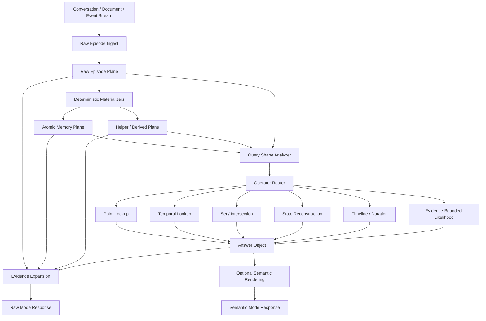
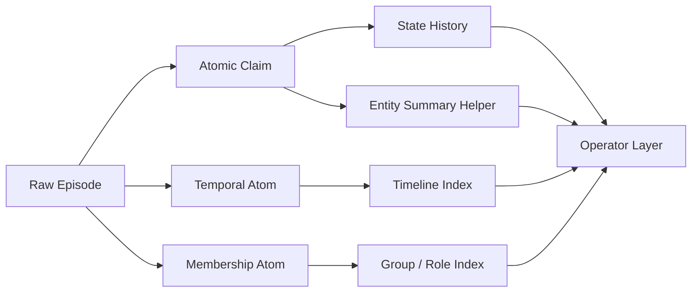

# Raw-First Memory Architecture for ai-knot

**Date:** 2026-04-13
**Author stance:** "MIT professor of memory systems"
**Constraints:**
- No benchmark-specific tuning
- Priority on `raw` / `dated` operation without LLM at query time
- No changes to tracing scripts in this plan
- Comparison against competitors must distinguish commodity vs novelty

---

## Executive Summary

`ai-knot` has crossed an important boundary. Phase E showed that retrieval is no longer the dominant failure mode. On the full `pf2` vs `pf3` comparison:

- `categories1to4`: `61.1% -> 65.9%` (`+4.8pp`)
- Cat1: `32.6% -> 40.4%`
- Cat2: `45.8% -> 46.4%`
- Cat3: `49.0% -> 45.8%`
- Cat4: `77.9% -> 84.2%`

Trace analysis shows the remaining failures are overwhelmingly `extraction_miss`, not retrieval loss:

- Cat1 wrongs: almost entirely `extraction_miss`
- Cat2 wrongs: almost entirely `extraction_miss`
- Cat3 wrongs: almost entirely `extraction_miss`
- Cat4 wrongs: almost entirely `extraction_miss`

This means the next architectural leap should not be "better search weights". It should be:

1. Preserve raw episodes as first-class memory
2. Deterministically materialize atomic claims from raw episodes
3. Build helper/derived structures for set, temporal, and state reasoning
4. Answer in `raw` mode with deterministic operators and explicit evidence

The future of `ai-knot` is not "RAG with a nicer retriever". It is a **memory operating system** with:

- a raw substrate,
- a typed atomic claim layer,
- a helper/derived layer,
- and a deterministic memory algebra on top.

---

## 1. What ai-knot Becomes After This Plan

### Product Differentiation

After this plan, `ai-knot` would stand apart not because it has "better recall", but because it would offer a specific product identity:

**A raw-first, zero-LLM query-time memory engine with typed materialization and deterministic reasoning.**

That is different from the major product families:

| Product family | Typical promise | ai-knot after this plan |
|---|---|---|
| Vector memory products | "Store facts, retrieve semantically" | "Store episodes, materialize claims, reason deterministically" |
| Graph memory products | "Build a graph and traverse it" | "Use a lightweight typed memory algebra without requiring a graph DB" |
| Agentic memory products | "LLM decides when/how to search" | "`raw` mode works without an LLM at query time" |
| Raw-episode systems | "Preserve ground truth and search passages" | "Preserve ground truth and also expose typed state/temporal/set reasoning" |

### The New Positioning

`ai-knot` would no longer just be:

- a knowledge base,
- a memory wrapper,
- or a retriever over extracted facts.

It would become:

**An explainable memory substrate for agents where raw evidence, atomic state, and deterministic reasoning coexist in one system.**

### Why This Is a Strong Differentiator

Most systems choose one of these:

- raw text preservation,
- extracted facts,
- graph traversal,
- or agentic tool use.

The proposed direction combines:

- raw preservation,
- typed claim materialization,
- deterministic state reconstruction,
- zero-LLM query-time operation in `raw` mode,
- optional semantic rendering later.

That combination is much rarer than any single ingredient.

---

## 2. What This Will Change in LoCoMo Metrics

This section is not a benchmark-tuning proposal. It is a capability-to-metric mapping.

### Important Principle

The proposed work is generic. It helps LoCoMo only because LoCoMo contains the same memory problems found in real systems:

- missing atomic facts,
- temporal ambiguity,
- state updates,
- multi-entity overlap,
- duration computation,
- weak evidence grounding.

### Expected Direction of Impact

#### Cat1

**Expected effect: strong positive**

Why:
- Cat1 currently benefits from better routing, but many residual failures are still missing atomic facts.
- A raw-first atomic materialization layer should help recover:
  - common attributes,
  - multiple items under one concept,
  - cross-session overlap,
  - missing event/object/member facts.

What changes Cat1 specifically:
- set collection
- intersection over entities
- better materialization of repeated states/events from raw turns

Expected pattern:
- accuracy should rise most where questions require collecting or intersecting multiple atomic claims

#### Cat2

**Expected effect: moderate to strong positive**

Why:
- Cat2 is often not a retrieval ranking issue but a temporal encoding issue.
- The major lever is separating:
  - message time,
  - event time,
  - state validity time.

What changes Cat2 specifically:
- typed temporal materialization
- relative date normalization
- duration extraction
- event-time vs observation-time separation
- deterministic temporal lookup operators

Expected pattern:
- less confusion between session date and event date
- better handling of "when", "before", "after", "for how long", "since"

#### Cat3

**Expected effect: mixed short-term, positive medium-term**

Why:
- Some Cat3 questions are truly inferential and will not be fixed by retrieval alone.
- But many Cat3 failures currently come from absent evidence atoms such as:
  - status,
  - role,
  - social membership,
  - repeated pattern of behavior.

What changes Cat3 specifically:
- state reconstruction
- membership materialization
- evidence-bounded likelihood operators

Expected pattern:
- short-term gains may be smaller than Cat1/Cat2
- medium-term gains appear once state and relationship operators are implemented

#### Cat4

**Expected effect: positive**

Why:
- Cat4 already improved materially under Phase E.
- Residual failures are still mostly missing facts, not reranking loss.

What changes Cat4 specifically:
- broader atomic recovery from raw turns
- nucleus expansion from claims back to local evidence neighborhoods

Expected pattern:
- more single-detail questions become answerable because the system actually stores the relevant claim

### Metric Mapping by Capability

| Capability | Cat1 | Cat2 | Cat3 | Cat4 |
|---|---:|---:|---:|---:|
| Raw episode preservation | Medium | High | Medium | Medium |
| Atomic claim materialization | High | High | Medium | High |
| Temporal axis separation | Low | High | Medium | Low |
| Set/intersection operators | High | Low | Medium | Low |
| State reconstruction | Medium | Medium | High | Low |
| Evidence expansion | Medium | Medium | Medium | Medium |

### What Should Not Be Expected

This plan should not be sold as:

- "a guaranteed Cat3 miracle"
- "a retrieval-only improvement"
- or "a benchmark shortcut"

It is a memory-quality improvement. Benchmarks are only one way it will show up.

---

## 3. Detailed Plan: What to Build

The key shift is from a single-layer memory to a **three-plane memory architecture**.

### 3.1 Plane A — Raw Episode Plane

Purpose:
- preserve the original signal,
- avoid lossy extraction,
- make every later inference auditable.

Each raw episode object should carry:

- `episode_id`
- `thread_id` / `session_id`
- `turn_id`
- `speaker_id` or source actor id
- `role`
- `observed_at`
- `raw_text`
- `window_id` / ingest provenance
- source links to any derived atomic claims

Key idea:
- raw episodes are immutable
- they are not a fallback hack
- they are part of the primary memory architecture

### 3.2 Plane B — Atomic Memory Plane

Purpose:
- convert raw evidence into deterministic, typed, queryable claims
- minimize dependence on LLM extraction for core memory functionality

This plane should contain typed atomic claims such as:

- `state_claim`
  - entity, attribute, value
- `event_claim`
  - actor, action, object, place, event_time
- `membership_claim`
  - entity belongs to group / role / team / organization
- `interaction_claim`
  - entity met / worked with / visited / collaborated with another entity
- `duration_claim`
  - entity/activity lasted N units
- `transition_claim`
  - old value -> new value over time

Important:
- not every claim must be perfect
- but every claim must be typed and traceable to raw evidence

### 3.3 Plane C — Helper / Derived Plane

Purpose:
- support efficient reasoning without LLM at query time
- avoid recomputing everything from scratch

This plane should not be "free-form summary text".
It should be helper structures such as:

- normalized indices:
  - `(attribute, normalized_value) -> entity_ids`
- time indexes:
  - `(entity, attribute) -> ordered history`
- membership indexes:
  - `(group_id) -> member_ids`
- event neighborhood indexes:
  - `(event anchor) -> nearby episodes/claims`
- optional helper facts:
  - compact entity summaries
  - compact event summaries

This is where your current `_consolidate_phase()` belongs conceptually, but expanded and generalized.

### 3.4 The Correct Core Interface

The architecture should evolve from:

```python
postprocess_facts(raw_facts)
```

to:

```python
materialize(existing_state, delta_batch)
```

Why:
- the most valuable memory patterns are cross-session
- a batch-only transform misses long-range structure

### 3.5 Deterministic Materializers to Build

These should be pure code, no query-time LLM.

#### A. Episode segmentation
- split raw windows into speaker turns and local event units

#### B. Temporal materializer
- absolute dates
- relative dates
- durations
- intervals
- validity boundaries

#### C. Numeric/unit materializer
- quantities
- amounts
- durations
- frequencies

#### D. State materializer
- entity-attribute-value
- support current-state and historical-state lookup

#### E. Membership/role materializer
- teams
- classes
- companies
- project groups
- family/social roles

#### F. Event materializer
- actor-action-object-place-time
- event anchors for later expansion

#### G. Transition materializer
- state changes over time

### 3.6 Query-Time Operator Layer

This is the heart of `raw` mode.

Instead of asking an LLM to infer the answer from retrieved snippets, the system should choose a deterministic operator:

- `point_lookup`
- `temporal_lookup`
- `duration_compute`
- `set_collect`
- `set_intersection`
- `current_state_reconstruct`
- `timeline_reconstruct`
- `membership_list`
- `evidence_bounded_likelihood`

That last one matters for "might" / "likely" / "would" style questions:
- answer only if the evidence pattern supports a bounded inference
- otherwise abstain or return uncertainty explicitly

### 3.7 Evidence Expansion

After an operator produces an answer, expand back to raw evidence:

- source atomic claims
- source raw turns
- optional neighboring turns

This gives:
- trust,
- explainability,
- debugging,
- enterprise value.

### 3.8 Raw Mode vs Semantic Mode

#### Raw mode
- no LLM at query time
- deterministic operator + evidence bundle

#### Semantic mode
- same memory substrate
- optional LLM to phrase the answer naturally

The semantic layer should be downstream of memory quality, not upstream of it.

---

## 4. To-Be Architecture

### High-Level View



### Memory Object Model



### Data Contract Principles

1. Raw never disappears
2. Every atomic claim has provenance
3. Helper facts are optional accelerators, not sole truth
4. Query-time reasoning is operator-driven, not prompt-driven

---

## 5. Competitor Comparison: Commodity vs Novelty

### 5.1 What Competitors Already Do Directly

#### Raw preservation
- **MemMachine** preserves raw conversational episodes
- **memvid** stores larger raw session chunks
- **Letta** stores recall/archival memory and leans on retrieval over logs/chunks

This is not novel by itself.

#### Temporal graph / validity windows
- **Zep / Graphiti** has bi-temporal facts and invalidation
- **Hindsight / TEMPR** has explicit temporal retrieval channels
- **MAGMA** has a dedicated temporal graph

This is also not novel by itself.

#### Hybrid retrieval
- **Mem0**: vector + graph enrichment
- **Zep**: BM25 + vector + graph traversal
- **Letta**: vector + keyword in newer deployments
- **Hindsight**: BM25 + semantic + graph + temporal

Also not novel by itself.

### 5.2 What Is Similar but Not the Same

#### Nucleus/context expansion
- Similar to **MemMachine**
- Similar in spirit to raw-neighborhood retrieval systems

But in `ai-knot` it would be downstream of typed claims, not the main retrieval substrate.

#### Multi-plane memory
- Similar in spirit to **MAGMA**
- Similar in spirit to **Letta** tiers

But here the planes are:
- raw substrate,
- typed claims,
- helper structures,
not four graph DB views or LLM-managed memory tiers.

#### Spreading/activation-like behavior
- Similar in spirit to **Hindsight**

But the proposed direction prioritizes deterministic operators over graph walk dynamics.

### 5.3 What Is New or Strongly Differentiated

#### A. Raw-first + typed atomic materialization + zero-LLM query path

This combination is the most interesting differentiator.

Many systems have one or two of these:
- raw-first
- typed memory
- graph traversal
- zero-LLM retrieval

Very few package all of the following together:
- raw preservation,
- typed claim materialization,
- deterministic operator layer,
- evidence-backed `raw` mode with no query-time LLM.

#### B. Memory algebra instead of just search

This is the big conceptual leap.

Competitors usually do:
- search wider,
- rerank better,
- or traverse a graph.

The proposed `ai-knot` does:
- encode memory as objects with types and provenance,
- then apply query-time operators like:
  - intersection,
  - duration,
  - state reconstruction,
  - evidence-bounded likelihood.

That is closer to a **memory computation system** than a search product.

#### C. Lightweight alternative to graph-DB-heavy systems

Compared with Zep/Graphiti and MAGMA:
- no hard dependency on Neo4j/FalkorDB-style graph infrastructure
- no need to force all memory semantics into BFS traversal

That is a meaningful product distinction.

### 5.4 Comparison Table

| Capability | Mem0 | Letta | Zep/Graphiti | Hindsight | MAGMA | MemMachine | ai-knot after plan |
|---|---|---|---|---|---|---|---|
| Raw episode preservation | Partial | Partial | Weak | Partial | Partial | Yes | Yes |
| Typed atomic claims | Yes | Weak | Yes | Yes | Yes | Weak | Yes |
| Graph traversal as main engine | No | No | Yes | Yes | Yes | No | No |
| Zero-LLM query-time raw mode | No | No | Usually no | No | No | More similar | Yes |
| Deterministic set/time/state operators | Weak | Weak | Partial via graph | Partial | Partial | Weak | Strong target |
| Evidence expansion from atomic answer to raw proof | Weak | Weak | Partial | Partial | Partial | Strong | Strong |

---

## 6. Recommended Implementation Order

### Phase A — Foundation

1. Introduce raw episode objects as first-class memory
2. Add typed metadata container for provenance and structured payloads
3. Separate temporal axes:
   - observed time
   - event time
   - validity time

### Phase B — Atomic Materialization

4. Build deterministic materializers:
   - temporal
   - numeric/unit
   - state
   - membership
   - event
   - transition
5. Replace batch-only postprocessing with incremental materialization over global state

### Phase C — Query-Time Reasoning

6. Introduce operator router for `raw` mode
7. Implement:
   - point lookup
   - set collection
   - intersection
   - temporal lookup
   - duration
   - current state
   - evidence-bounded likelihood

### Phase D — Productization

8. Return structured raw answers with explicit evidence
9. Keep semantic mode as optional rendering over the same substrate

---

## 7. What This Means for the Existing User Plan

The earlier plan was directionally correct, but needs several corrections.

### Correct
- Do not spend another cycle on retriever tuning
- Keep Phase E intact
- Move reasoning out of LLM-on-query
- Build derived/helper structures

### Needs Revision

#### 1. `postprocess_facts(facts)` is too local
Derived memory must be computed over persistent memory state, not only over the latest batch.

#### 2. Summary facts should not come before atomic facts
If the atomic claim is missing, summary does not help.

#### 3. Shared facts should not be fully materialized offline
Use helper indexes + query-time set operations instead.

#### 4. `qualifiers` is not enough
Current `dict[str, str]` typing is too weak for real payloads and provenance.

#### 5. `slot_key` should not carry synthetic group semantics
That would overload CAS and ranking assumptions.

---

## 8. Harvard Professor Critique

Now let us critique this plan from a different elite academic stance: a skeptical Harvard professor of information systems and empirical ML.

### The Critique

> "This plan is intellectually elegant, but elegance is not evidence. You are proposing a memory architecture with multiple representational planes, typed materializers, provenance, operator routing, and deterministic inference. That is a large systems program. The danger is obvious: you may end up building a beautiful ontology machine whose operational gains come only from a small subset of simple heuristics.
>
> The empirical warning signs are:
>
> 1. You are attributing residual error to 'extraction' broadly, but that bucket may mix several phenomena:
>    - true encoding miss,
>    - fuzzy matching artifacts in the analysis,
>    - representational mismatch,
>    - and answerability mismatch.
>
> 2. Your proposed materializers assume that generic rule-based parsing will recover a large fraction of missing facts from free text. That may be true for dates, durations, and explicit states, but much less true for nuanced social facts, implicit causality, and conversationally elliptical references.
>
> 3. The plan risks overengineering. Graph-lite helper structures, query-time operators, and raw evidence expansion all sound good, but unless you strictly prioritize the top few value-producing operators, the complexity budget will explode before user value does.
>
> 4. There is a hidden philosophical contradiction. You say 'raw-first' and 'deterministic', but the moment you rely on weak generic materializers, you are still designing a lossy interpretation layer. The real question is not whether the system is deterministic. The real question is whether the interpretation errors are materially better than the current extraction errors.
>
> 5. Finally, product differentiation is not the same thing as user value. 'Memory operating system' is a strong concept, but customers pay for reliability, speed, and observability, not for architectural poetry."

### The Strongest Harvard Objections

#### Objection 1: "You are still parsing language, just with code instead of an LLM."

This is fair.

Response:
- yes, deterministic materialization is still interpretation
- but it is cheaper, auditable, and bounded
- and it should be limited to classes where rules are genuinely robust:
  - dates,
  - durations,
  - state/value mentions,
  - memberships,
  - explicit event patterns

#### Objection 2: "The architecture is too broad."

Also fair.

Response:
- the roadmap must be narrowed to a minimal operator core first:
  - temporal lookup
  - state reconstruction
  - set/intersection
  - duration

#### Objection 3: "You have not proven this beats simply storing raw episodes and searching them better."

This is the strongest critique.

Response:
- the architecture must preserve raw episodes anyway
- and every typed plane must justify itself by measurable gains beyond raw-only retrieval

### The Harvard Version of the Recommendation

If Harvard were signing off on this, they would likely insist on:

1. Keep the plan, but reduce the first implementation to the smallest high-yield core
2. Preserve raw evidence so that every added typed layer can be ablated
3. Demand per-layer empirical justification
4. Avoid grand abstraction before the first four operators prove themselves

In other words:

> "Proceed, but with ruthless ablation discipline."

That is excellent advice.

---

## 9. Final Recommendation

The right move is not another retriever phase.

The right move is to turn `ai-knot` into:

**a raw-first, typed, explainable memory engine with deterministic operators in `raw` mode and optional semantic rendering on top.**

This direction:

- respects the no-benchmark-tuning constraint,
- aligns with the actual post-Phase-E bottleneck,
- preserves product identity,
- and creates a meaningful differentiator against vector-only, graph-only, and agentic-only memory products.

If executed carefully, it can become the defining architectural move for `ai-knot`.
