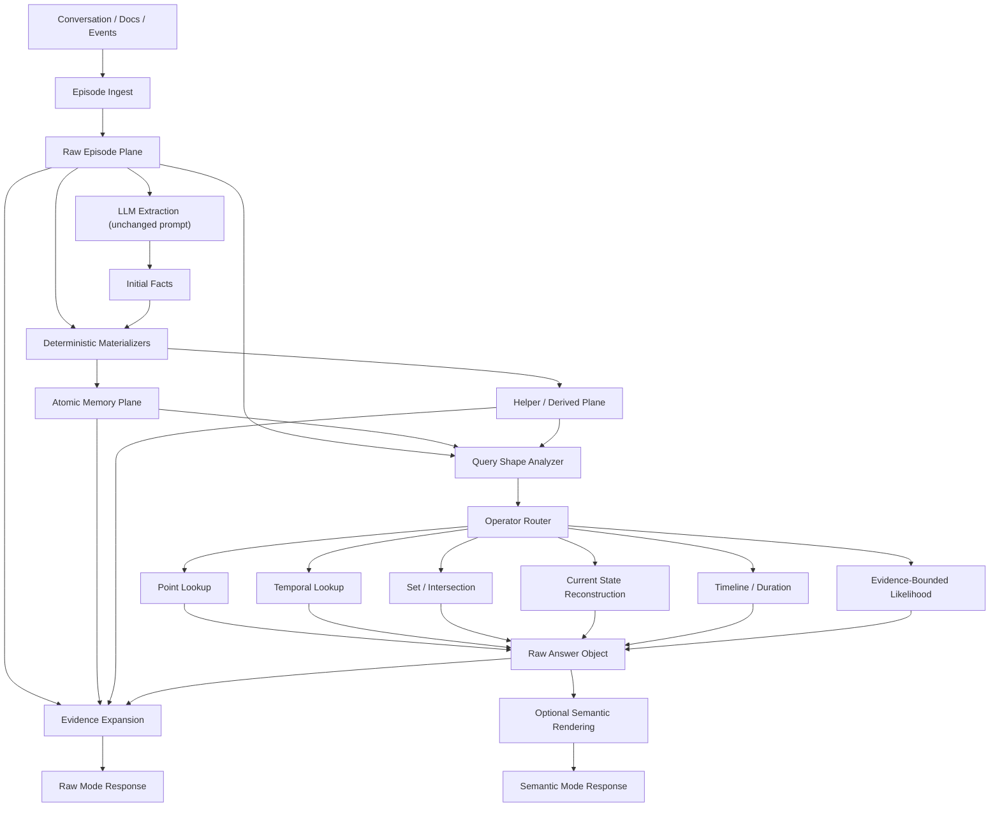

# ai-knot Raw-First Plan V2

**Date:** 2026-04-13  
**Status:** Final draft  
**Scope:** single-agent core first, multi-agent as follow-up research track  
**Constraints:**
- no benchmark-specific tuning
- priority on `raw` / `dated` operation without LLM at query time
- Phase E retriever is preserved as the current retrieval baseline
- tracing scripts are not part of this plan

---

## 1. Executive Summary

`ai-knot` should evolve from a fact retriever into a **raw-first memory engine** with three explicit planes:

1. `Raw Episode Plane` — immutable ground-truth conversation turns and events
2. `Atomic Memory Plane` — typed, normalized claims materialized from raw evidence
3. `Helper / Derived Plane` — operator-friendly structures for set, temporal, and state reasoning

The key shift is architectural:

- from `facts-only storage`
- to `raw substrate + typed claims + helper layer`

And at query time:

- from `retrieve top-k facts and hope the answer emerges`
- to `retrieve claims, run deterministic operators, attach evidence`

This is not a LoCoMo hack. It is a generic memory-system upgrade for any product that needs:

- explainable answers
- deterministic raw mode
- lower query-time cost
- better temporal/state reasoning
- safer recovery and rebuild

---

## 2. Why We Are Changing the Plan

Phase E largely solved the retrieval bottleneck. The remaining failure mode is mostly **encoding / extraction / materialization loss**, not RRF/MMR loss.

That means the original plan was directionally right, but incomplete.

### What stays from the original plan

- keep Phase E
- keep `raw` mode free of LLM calls at query time
- move reasoning into deterministic code
- add derived/helper memory
- support `raw` and `semantic` as two modes over one memory substrate

### What changes in V2

- `postprocess_facts(batch)` becomes `materialize(existing_state, delta_batch, episodes)`
- summaries are no longer the first priority; atomic claim recovery comes first
- derived facts are not the whole solution; query-time operators become first-class
- raw episodes become part of the real memory model, not just discarded source text
- helper materialization must avoid combinatorial explosion

---

## 3. Product Thesis After V2

After V2, `ai-knot` is best described as:

**An explainable raw-first memory substrate for agents that preserves evidence, materializes typed memory, and answers in raw mode without an LLM at query time.**

This is stronger than:

- "knowledge base instead of log"
- "better memory retrieval"
- "fact extraction with BM25"

Because it defines a full memory stack:

- truth substrate
- normalized claims
- helper structures
- deterministic inference
- optional semantic rendering

---

## 4. To-Be Architecture



---

## 5. What and Why We Change

### 5.1 Raw Episode Plane

We add a first-class raw substrate.

#### Why

- current extraction loses too much information
- helper/derived memory is only trustworthy when it can point back to source evidence
- recovery and rebuild should not depend on re-calling the extractor LLM

#### What it stores

- `episode_id`
- `thread_id` / `session_id`
- `turn_id`
- `speaker_id`
- `role`
- `observed_at`
- `raw_text`
- `window_id`
- provenance links to derived claims

#### Principle

Raw episodes are immutable and auditable. They are not the main retrieval surface, but they are the ground-truth substrate.

### 5.2 Atomic Memory Plane

We promote typed claims to the center of the memory model.

#### Why

- current `Fact` is too string-centric
- aggregation, temporal and state queries need normalized units, not only text
- raw mode cannot be reliable if all reasoning starts from loosely shaped strings

#### Core atomic claim kinds

- `state_claim`
- `event_claim`
- `duration_claim`
- `membership_claim`
- `interaction_claim`
- `transition_claim`

### 5.3 Helper / Derived Plane

We add operator-friendly helper memory instead of bulk synthetic text.

#### Why

- queries like “what do they have in common?”, “how long?”, “what changed?” are algebraic
- the answer should come from indexes/operators, not from one giant prewritten summary fact
- helper structures must stay sparse and rebuildable

#### Examples

- `(attribute, normalized_value) -> entity_ids`
- slot history index
- claim-to-episode evidence index
- timeline index
- membership index

### 5.4 Raw Operator Layer

We add deterministic operators for `raw` mode.

#### Why

- retrieved facts alone are not a reliable answering model
- LLM-free raw mode needs explicit query-time reasoning primitives

#### Operators

- `point_lookup`
- `temporal_lookup`
- `duration_compute`
- `set_collect`
- `set_intersection`
- `current_state_reconstruct`
- `timeline_reconstruct`
- `evidence_bounded_likelihood`

---

## 6. Concrete Code Changes

### 6.1 Core Schema

#### File

[src/ai_knot/types.py](/Users/alsoleg/Documents/github/ai-knot/src/ai_knot/types.py)

#### Changes

- add `Episode` dataclass
- extend `Fact` with:
  - `record_kind`: `atomic` / `helper`
  - `claim_kind`: `state` / `event` / `duration` / `membership` / `interaction` / `transition`
  - `payload: dict[str, Any]`
  - `meta: dict[str, Any]`
  - `observed_at`
  - `event_start`
  - `event_end`
  - `source_turn_ids: list[str]`
  - `derived_from_ids: list[str]`
  - `materializer_version`

#### Important note

Current `qualifiers: dict[str, str]` stays only for lightweight scalar modifiers and backward compatibility. It should no longer be the main storage place for structured provenance or typed aggregates.

### 6.2 Storage Layer

#### Files

- [src/ai_knot/storage/base.py](/Users/alsoleg/Documents/github/ai-knot/src/ai_knot/storage/base.py)
- [src/ai_knot/storage/sqlite_storage.py](/Users/alsoleg/Documents/github/ai-knot/src/ai_knot/storage/sqlite_storage.py)
- [src/ai_knot/storage/yaml_storage.py](/Users/alsoleg/Documents/github/ai-knot/src/ai_knot/storage/yaml_storage.py)
- [src/ai_knot/storage/postgres_storage.py](/Users/alsoleg/Documents/github/ai-knot/src/ai_knot/storage/postgres_storage.py)

#### Changes

- add `episodes` storage primitives
- add `payload` and `meta` JSON persistence for facts
- add temporal fields for event time and observation time
- add snapshot/export/import support for the whole bundle:
  - episodes
  - facts
  - schema version
  - materializer version

#### SQLite specifics

- add `episodes` table
- add indexes on:
  - `record_kind`
  - `claim_kind`
  - `slot_key`
  - `event_start`
  - `observed_at`

#### YAML specifics

- add `episodes.yaml`
- stop stringifying structured JSON payloads on load
- preserve backward compatibility for old `knowledge.yaml`

### 6.3 Learn Pipeline

#### File

[src/ai_knot/learning.py](/Users/alsoleg/Documents/github/ai-knot/src/ai_knot/learning.py)

#### Current pipeline

`extract -> candidate -> resolve -> consolidate -> commit`

#### New pipeline

`episode -> extract -> normalize -> resolve -> materialize -> commit`

#### Changes by function

- `learn()`:
  - add Stage 0 `_episode_phase(turns)`
  - load `existing episodes + facts`
  - run new materialization stage
- `_candidate_phase()`:
  - stop being pass-through
  - normalize dates, durations, quantities, enumerations, memberships, interaction hints
- `_consolidate_phase()`:
  - replace with `_materialize_phase(existing, delta, episodes)`
- `_commit_phase()`:
  - commit episodes and facts atomically where backend supports it

### 6.4 Extractor

#### File

[src/ai_knot/extractor.py](/Users/alsoleg/Documents/github/ai-knot/src/ai_knot/extractor.py)

#### Changes

- do **not** change `_EXTRACTION_SYSTEM_PROMPT`
- keep `Extractor.extract()` as current LLM extractor
- keep current enumeration split / ATC / source snippets
- only adjust parser if needed to map extracted fields into richer typed claims

### 6.5 Materialization Engine

#### New file

`src/ai_knot/materialization.py`

#### Main responsibilities

- `materialize_atomic(existing_state, episodes, extracted_facts)`
- `materialize_helper(existing_state, atomic_claims)`
- `normalize_temporal_claims()`
- `normalize_duration_claims()`
- `materialize_memberships()`
- `materialize_interactions()`
- `materialize_transitions()`
- `rebuild_helper_plane()`

#### Important rule

No LLM calls inside materialization.

### 6.6 Raw Query Engine

#### Files

- new `src/ai_knot/raw_query.py`
- update [src/ai_knot/knowledge.py](/Users/alsoleg/Documents/github/ai-knot/src/ai_knot/knowledge.py)

#### Changes

- add `RawAnswer`, `RawAnswerItem`, `RawTrace`
- add `raw_query()`
- add `raw_query_with_trace()`
- route query shape to deterministic operators

### 6.7 Recall Core Changes

#### File

[src/ai_knot/knowledge.py](/Users/alsoleg/Documents/github/ai-knot/src/ai_knot/knowledge.py)

#### Changes

- `_execute_recall()` becomes plane-aware
- stop assuming all `EPISODIC` memory should be hidden from default retrieval
- retrieve helper claims when query shape requires them
- support evidence expansion after operator result

#### Explicit V2 decision

The current default `EPISODIC` exclusion is treated as a **semantic conflict**, not a footnote.

- `recall()` keeps conservative prompt-oriented behavior by default
- `_execute_recall()` gains explicit visibility controls instead of hard-coded episodic suppression
- `raw_query()` uses either:
  - explicit `include_episodic=True`, or
  - a dedicated raw retrieval path over claims + episodes

This avoids ending up with two incompatible memories:

- one visible to `recall()`
- another visible only to `raw_query()`

#### Product API split

- `recall()` remains a prompt-oriented convenience path
- `raw_query()` becomes the first-class deterministic API
- `semantic` mode can be built on top later

### 6.8 Decay

#### Files

- [src/ai_knot/forgetting.py](/Users/alsoleg/Documents/github/ai-knot/src/ai_knot/forgetting.py)
- [src/ai_knot/knowledge.py](/Users/alsoleg/Documents/github/ai-knot/src/ai_knot/knowledge.py)

#### Changes

Move from one-size-fits-all decay to plane-aware policies:

- raw episodes:
  - no destructive forgetting
  - retrieval salience can fade
- active current-state claims:
  - very slow decay or decay immunity
- episodic/event claims:
  - current power-law remains a good base
- superseded claims:
  - reduced ranking salience, but retained for timeline reconstruction
- helper claims:
  - should not have independent psychological memory
  - score follows source claims or is recomputed

### 6.9 Infra / Snapshots / Restore

#### Files

- [src/ai_knot/storage/sqlite_storage.py](/Users/alsoleg/Documents/github/ai-knot/src/ai_knot/storage/sqlite_storage.py)
- [src/ai_knot/storage/yaml_storage.py](/Users/alsoleg/Documents/github/ai-knot/src/ai_knot/storage/yaml_storage.py)
- [src/ai_knot/cli.py](/Users/alsoleg/Documents/github/ai-knot/src/ai_knot/cli.py)
- [src/ai_knot/mcp_server.py](/Users/alsoleg/Documents/github/ai-knot/src/ai_knot/mcp_server.py)

#### Changes

- snapshots become bundle snapshots
- restore must support:
  - direct restore
  - restore + `rebuild_materialized()`
- export/import must include episodes
- add schema version and materializer version
- `replace_facts()` becomes explicitly unsafe in bundle-backed memory unless run in legacy mode

#### Explicit V2 decision

`replace_facts()` must not silently leave episodes/helper state behind.

Recommended behavior:

- allow `replace_facts()` only for legacy facts-only bundles
- if episodes exist, raise loudly and point callers to:
  - `replace_bundle()`
  - `restore()`
  - `import_bundle()`

### 6.10 Reference Code Snippets

These snippets are intentionally implementation-oriented. They are not meant to be pasted blindly as-is, but they define the target shape of the code.

#### 6.10.1 `types.py` — `Episode` and enriched `Fact`

```python
from __future__ import annotations

from dataclasses import dataclass, field
from datetime import UTC, datetime
from enum import StrEnum
from typing import Any
from uuid import uuid4


class RecordKind(StrEnum):
    ATOMIC = "atomic"
    HELPER = "helper"


class ClaimKind(StrEnum):
    STATE = "state"
    EVENT = "event"
    DURATION = "duration"
    MEMBERSHIP = "membership"
    INTERACTION = "interaction"
    TRANSITION = "transition"


@dataclass
class Episode:
    episode_id: str = field(default_factory=lambda: uuid4().hex[:12])
    thread_id: str = ""
    session_id: str = ""
    turn_id: str = ""
    speaker_id: str = ""
    role: str = ""
    observed_at: datetime = field(default_factory=lambda: datetime.now(UTC))
    raw_text: str = ""
    window_id: str = ""
    meta: dict[str, Any] = field(default_factory=dict)


@dataclass
class Fact:
    content: str
    type: MemoryType = MemoryType.SEMANTIC
    importance: float = 0.8
    id: str = field(default_factory=lambda: uuid4().hex[:8])

    record_kind: RecordKind = RecordKind.ATOMIC
    claim_kind: ClaimKind | None = None

    payload: dict[str, Any] = field(default_factory=dict)
    meta: dict[str, Any] = field(default_factory=dict)

    observed_at: datetime = field(default_factory=lambda: datetime.now(UTC))
    event_start: datetime | None = None
    event_end: datetime | None = None

    source_turn_ids: list[str] = field(default_factory=list)
    derived_from_ids: list[str] = field(default_factory=list)
    materializer_version: str = "v2"

    qualifiers: dict[str, str] = field(default_factory=dict)
```

#### 6.10.2 `storage/base.py` — bundle-aware interface

```python
from typing import Protocol


class EpisodeStorageCapable(Protocol):
    def save_episodes(self, agent_id: str, episodes: list[Episode]) -> None: ...
    def load_episodes(self, agent_id: str) -> list[Episode]: ...


class BundleStorageCapable(Protocol):
    def save_bundle(
        self,
        agent_id: str,
        *,
        episodes: list[Episode],
        facts: list[Fact],
        schema_version: str,
        materializer_version: str,
    ) -> None: ...

    def load_bundle(self, agent_id: str) -> dict[str, object]: ...
```

#### 6.10.3 `sqlite_storage.py` — `episodes` table

```sql
CREATE TABLE IF NOT EXISTS episodes (
    episode_id    TEXT NOT NULL,
    agent_id      TEXT NOT NULL,
    thread_id     TEXT NOT NULL DEFAULT '',
    session_id    TEXT NOT NULL DEFAULT '',
    turn_id       TEXT NOT NULL DEFAULT '',
    speaker_id    TEXT NOT NULL DEFAULT '',
    role          TEXT NOT NULL DEFAULT '',
    observed_at   TEXT NOT NULL,
    raw_text      TEXT NOT NULL,
    window_id     TEXT NOT NULL DEFAULT '',
    meta_json     TEXT NOT NULL DEFAULT '{}',
    PRIMARY KEY (agent_id, episode_id)
);

CREATE INDEX IF NOT EXISTS idx_episodes_observed
ON episodes(agent_id, observed_at);
```

#### 6.10.4 `sqlite_storage.py` — extra columns on `facts`

```sql
ALTER TABLE facts ADD COLUMN record_kind TEXT NOT NULL DEFAULT 'atomic';
ALTER TABLE facts ADD COLUMN claim_kind TEXT NOT NULL DEFAULT '';
ALTER TABLE facts ADD COLUMN payload_json TEXT NOT NULL DEFAULT '{}';
ALTER TABLE facts ADD COLUMN meta_json TEXT NOT NULL DEFAULT '{}';
ALTER TABLE facts ADD COLUMN observed_at TEXT NOT NULL DEFAULT '';
ALTER TABLE facts ADD COLUMN event_start TEXT;
ALTER TABLE facts ADD COLUMN event_end TEXT;
ALTER TABLE facts ADD COLUMN source_turn_ids_json TEXT NOT NULL DEFAULT '[]';
ALTER TABLE facts ADD COLUMN derived_from_ids_json TEXT NOT NULL DEFAULT '[]';
ALTER TABLE facts ADD COLUMN materializer_version TEXT NOT NULL DEFAULT 'v2';

CREATE INDEX IF NOT EXISTS idx_facts_record_kind
ON facts(agent_id, record_kind);

CREATE INDEX IF NOT EXISTS idx_facts_claim_kind
ON facts(agent_id, claim_kind);

CREATE INDEX IF NOT EXISTS idx_facts_event_start
ON facts(agent_id, event_start);
```

#### 6.10.5 `yaml_storage.py` — bundle shape

```yaml
schema_version: "v2"
materializer_version: "v2"

episodes:
  e01:
    thread_id: "conv-17"
    session_id: "s-2026-04-13"
    turn_id: "t-0001"
    speaker_id: "jon"
    role: "user"
    observed_at: "2026-04-13T10:00:00+00:00"
    raw_text: "It took six months to open the studio."
    meta:
      source: "chat"

facts:
  f01:
    content: "Jon opened the studio in six months"
    record_kind: "atomic"
    claim_kind: "duration"
    payload:
      subject: "Jon"
      activity: "open studio"
      value: 6
      unit: "month"
    source_turn_ids: ["t-0001"]
```

#### 6.10.6 `learning.py` — new `learn()` pipeline

```python
def learn(
    self,
    turns: list[ConversationTurn],
    *,
    api_key: str | None = None,
    provider: str | LLMProvider | None = None,
    model: str | None = None,
    conflict_threshold: float = 0.7,
    timeout: float | None = None,
    batch_size: int = 20,
    **provider_kwargs: str,
) -> list[Fact]:
    if not turns:
        return []

    # Stage 0: preserve raw evidence first.
    episodes = self._episode_phase(turns)

    # Stage 1: current extractor path, prompt unchanged.
    extracted = self._extract_phase(
        turns,
        provider=provider,
        api_key=api_key,
        model=model,
        timeout=timeout,
        batch_size=batch_size,
        **provider_kwargs,
    )

    # Stage 2: deterministic normalization over extracted facts and raw turns.
    normalized = self._candidate_phase(extracted, episodes)

    # Stage 3: resolve against existing atomic state.
    bundle = self._storage.load_bundle(self._agent_id)
    existing_facts = bundle["facts"]
    existing_episodes = bundle["episodes"]

    to_insert = self._resolve_phase(normalized, existing_facts, conflict_threshold)

    # Stage 4: materialize helper/index claims.
    materialized = self._materialize_phase(
        existing_facts=existing_facts,
        existing_episodes=existing_episodes,
        new_atomic=to_insert,
        new_episodes=episodes,
    )

    # Stage 5: commit bundle atomically.
    self._commit_phase(
        existing_episodes=existing_episodes,
        existing_facts=existing_facts,
        new_episodes=episodes,
        new_facts=to_insert + materialized,
    )
    return to_insert + materialized
```

#### 6.10.7 `learning.py` — `_episode_phase()`

```python
def _episode_phase(self, turns: list[ConversationTurn]) -> list[Episode]:
    episodes: list[Episode] = []
    now = datetime.now(UTC)
    for idx, turn in enumerate(turns):
        episodes.append(
            Episode(
                thread_id=self._agent_id,
                session_id=now.strftime("%Y%m%dT%H%M%S"),
                turn_id=f"turn-{idx:04d}",
                speaker_id=(turn.role or "unknown"),
                role=turn.role,
                observed_at=turn.timestamp or now,
                raw_text=turn.content,
                meta={"ingest_source": "learn"},
            )
        )
    return episodes
```

#### 6.10.8 `materialization.py` — entry point

```python
def materialize(
    *,
    existing_facts: list[Fact],
    existing_episodes: list[Episode],
    new_atomic: list[Fact],
    new_episodes: list[Episode],
) -> list[Fact]:
    active_atomic = [f for f in existing_facts if f.record_kind == RecordKind.ATOMIC and f.is_active()]
    all_atomic = active_atomic + new_atomic
    all_episodes = existing_episodes + new_episodes

    helper: list[Fact] = []
    helper.extend(materialize_state_timelines(all_atomic))
    helper.extend(materialize_membership_index(all_atomic))
    helper.extend(materialize_value_to_entity_index(all_atomic))
    helper.extend(materialize_claim_evidence_index(all_atomic, all_episodes))
    helper.extend(materialize_duration_rollups(all_atomic))
    return helper
```

#### 6.10.9 `materialization.py` — duration claim normalization

```python
def normalize_duration_claims(facts: list[Fact], episodes: list[Episode]) -> list[Fact]:
    out: list[Fact] = []
    for fact in facts:
        text = (fact.content or "").lower()
        if "month" not in text and "week" not in text and "day" not in text:
            continue

        parsed = parse_duration_phrase(text)
        if parsed is None:
            continue

        out.append(
            Fact(
                content=fact.content,
                type=fact.type,
                record_kind=RecordKind.ATOMIC,
                claim_kind=ClaimKind.DURATION,
                payload={
                    "subject": fact.entity or "",
                    "activity": fact.attribute or "",
                    "value": parsed.value,
                    "unit": parsed.unit,
                },
                observed_at=fact.created_at,
                source_turn_ids=list(fact.meta.get("source_turn_ids", [])),
                derived_from_ids=[fact.id],
                slot_key=f"{fact.entity}::duration::{fact.attribute}" if fact.entity else "",
                importance=fact.importance,
            )
        )
    return out
```

#### 6.10.10 `materialization.py` — sparse shared-value helper

```python
def materialize_value_to_entity_index(facts: list[Fact]) -> list[Fact]:
    buckets: dict[tuple[str, str], set[str]] = {}
    source_ids: dict[tuple[str, str], list[str]] = {}

    for fact in facts:
        if fact.claim_kind != ClaimKind.STATE:
            continue
        attr = fact.attribute.strip().lower()
        value = str(fact.payload.get("value", "")).strip().lower()
        entity = fact.entity.strip().lower()
        if not attr or not value or not entity:
            continue
        key = (attr, value)
        buckets.setdefault(key, set()).add(entity)
        source_ids.setdefault(key, []).append(fact.id)

    helper: list[Fact] = []
    for (attr, value), entities in buckets.items():
        if len(entities) < 2:
            continue
        helper.append(
            Fact(
                content=f"{attr}={value}",
                record_kind=RecordKind.HELPER,
                claim_kind=ClaimKind.STATE,
                payload={"attribute": attr, "value": value, "entities": sorted(entities)},
                derived_from_ids=source_ids[(attr, value)],
                tags=["helper", "value_to_entity_index"],
            )
        )
    return helper
```

#### 6.10.11 `raw_query.py` — answer objects

```python
from dataclasses import dataclass, field
from typing import Any


@dataclass
class RawAnswerItem:
    label: str
    value: str
    claim_ids: list[str] = field(default_factory=list)
    episode_ids: list[str] = field(default_factory=list)


@dataclass
class RawTrace:
    query_shape: str
    operator_used: str
    source_claim_ids: list[str] = field(default_factory=list)
    source_episode_ids: list[str] = field(default_factory=list)
    helper_ids: list[str] = field(default_factory=list)


@dataclass
class RawAnswer:
    status: str
    items: list[RawAnswerItem] = field(default_factory=list)
    confidence: float = 0.0
    trace: RawTrace | None = None
```

#### 6.10.12 `raw_query.py` — operator routing

```python
def raw_query(self, query: str, *, now: datetime | None = None) -> RawAnswer:
    shape = classify_raw_query_shape(query)
    claims = self._retrieve_claims_for_raw(query, shape=shape, now=now)

    if shape == "point_lookup":
        return point_lookup(query, claims)
    if shape == "temporal_lookup":
        return temporal_lookup(query, claims)
    if shape == "duration":
        return duration_compute(query, claims)
    if shape == "set_intersection":
        return set_intersection(query, claims)
    if shape == "current_state":
        return current_state_reconstruct(query, claims)
    if shape == "timeline":
        return timeline_reconstruct(query, claims)
    if shape == "likelihood":
        return evidence_bounded_likelihood(query, claims)
    return point_lookup(query, claims)
```

#### 6.10.13 `raw_query.py` — `set_intersection()`

```python
def set_intersection(query: str, claims: list[Fact]) -> RawAnswer:
    entities = extract_query_entities(query)
    if len(entities) < 2:
        return RawAnswer(status="not_enough_entities", confidence=0.0)

    by_entity: dict[str, set[tuple[str, str]]] = {}
    supporting_claims: list[str] = []

    for claim in claims:
        if claim.claim_kind != ClaimKind.STATE:
            continue
        entity = claim.entity.strip().lower()
        value = str(claim.payload.get("value", "")).strip().lower()
        attr = claim.attribute.strip().lower()
        if entity not in entities or not value or not attr:
            continue
        by_entity.setdefault(entity, set()).add((attr, value))
        supporting_claims.append(claim.id)

    shared: set[tuple[str, str]] | None = None
    for entity in entities:
        values = by_entity.get(entity, set())
        shared = values if shared is None else shared & values

    if not shared:
        return RawAnswer(status="no_shared_values", confidence=0.25)

    items = [
        RawAnswerItem(label=attr, value=value, claim_ids=supporting_claims)
        for attr, value in sorted(shared)
    ]
    return RawAnswer(
        status="ok",
        items=items,
        confidence=0.9,
        trace=RawTrace(
            query_shape="set_intersection",
            operator_used="set_intersection",
            source_claim_ids=supporting_claims,
        ),
    )
```

#### 6.10.14 `raw_query.py` — `current_state_reconstruct()`

```python
def current_state_reconstruct(query: str, claims: list[Fact]) -> RawAnswer:
    entity, attribute = extract_entity_and_attribute(query)
    candidates = [
        c for c in claims
        if c.claim_kind == ClaimKind.STATE
        and c.entity.strip().lower() == entity
        and c.attribute.strip().lower() == attribute
        and c.is_active()
    ]
    if not candidates:
        return RawAnswer(status="not_found", confidence=0.0)

    best = max(
        candidates,
        key=lambda c: (
            c.valid_from,
            c.state_confidence,
            c.importance,
        ),
    )
    return RawAnswer(
        status="ok",
        items=[
            RawAnswerItem(
                label=attribute,
                value=str(best.payload.get("value", best.value_text)),
                claim_ids=[best.id],
                episode_ids=list(best.source_turn_ids),
            )
        ],
        confidence=min(1.0, 0.6 + 0.4 * best.state_confidence),
        trace=RawTrace(
            query_shape="current_state",
            operator_used="current_state_reconstruct",
            source_claim_ids=[best.id],
            source_episode_ids=list(best.source_turn_ids),
        ),
    )
```

#### 6.10.15 `evidence.py` — claim to episode expansion

```python
def expand_evidence(
    answer: RawAnswer,
    *,
    episodes: list[Episode],
    claims: list[Fact],
    max_episodes: int = 5,
) -> RawAnswer:
    if answer.trace is None:
        return answer

    turn_ids = set(answer.trace.source_episode_ids)
    for claim in claims:
        if claim.id in answer.trace.source_claim_ids:
            turn_ids.update(claim.source_turn_ids)

    selected = [ep for ep in episodes if ep.turn_id in turn_ids]
    selected.sort(key=lambda ep: ep.observed_at)
    selected = selected[:max_episodes]

    answer.trace.source_episode_ids = [ep.turn_id for ep in selected]
    return answer
```

#### 6.10.16 `forgetting.py` — plane-aware decay

```python
def apply_decay_v2(
    facts: list[Fact],
    *,
    now: datetime | None = None,
    type_exponents: dict[str, float] | None = None,
) -> list[Fact]:
    now = now or datetime.now(UTC)
    for fact in facts:
        if fact.record_kind == RecordKind.HELPER:
            fact.retention_score = derive_helper_retention(fact, facts)
            continue

        if fact.claim_kind == ClaimKind.STATE and fact.is_active(now):
            fact.retention_score = 1.0 if fact.state_confidence >= 0.9 else 0.95
            continue

        if fact.valid_until is not None:
            base = calculate_retention(fact, now=now, type_exponents=type_exponents)
            fact.retention_score = min(base, 0.6)
            continue

        fact.retention_score = calculate_retention(fact, now=now, type_exponents=type_exponents)
    return facts
```

#### 6.10.17 `knowledge.py` — rebuild helper plane

```python
def rebuild_materialized(self) -> list[Fact]:
    bundle = self._storage.load_bundle(self._agent_id)
    episodes: list[Episode] = bundle["episodes"]
    facts: list[Fact] = bundle["facts"]

    atomic = [f for f in facts if f.record_kind == RecordKind.ATOMIC]
    rebuilt_helper = rebuild_helper_plane(atomic, episodes)

    preserved_atomic = atomic + [f for f in facts if f.record_kind == RecordKind.ATOMIC and f not in atomic]
    self._storage.save_bundle(
        self._agent_id,
        episodes=episodes,
        facts=preserved_atomic + rebuilt_helper,
        schema_version="v2",
        materializer_version="v2",
    )
    return rebuilt_helper
```

#### 6.10.18 `knowledge.py` — safe `replace_facts()`

```python
def replace_facts(self, facts: list[Fact]) -> None:
    bundle = self._storage.load_bundle(self._agent_id)
    episodes: list[Episode] = bundle["episodes"]
    existing_facts: list[Fact] = bundle["facts"]

    has_v2_state = bool(episodes) or any(
        getattr(f, "record_kind", "atomic") != "atomic" for f in existing_facts
    )
    if has_v2_state:
        raise RuntimeError(
            "replace_facts() is unsafe for bundle-backed memory. "
            "Use replace_bundle(), import_bundle(), or restore(..., rebuild_helper=True)."
        )

    self._storage.save_bundle(
        self._agent_id,
        episodes=[],
        facts=facts,
        schema_version="v2",
        materializer_version="v2",
    )
```

#### 6.10.19 `knowledge.py` — plane-aware `_execute_recall()`

```python
def _execute_recall(
    self,
    query: str,
    *,
    top_k: int,
    now: datetime | None = None,
    include_unsupported: bool = False,
    include_episodic: bool = False,
    record_kinds: set[RecordKind] | None = None,
    claim_kinds: set[ClaimKind] | None = None,
    trace: dict[str, Any] | None = None,
) -> list[tuple[Fact, float]]:
    all_facts = self._storage.load(self._agent_id)
    now_dt = now or datetime.now(UTC)

    facts = []
    for fact in all_facts:
        if not fact.is_active(now_dt):
            continue
        if not include_unsupported and fact.supported is False:
            continue
        if not include_episodic and fact.type == MemoryType.EPISODIC:
            continue
        if record_kinds is not None and getattr(fact, "record_kind", RecordKind.ATOMIC) not in record_kinds:
            continue
        if claim_kinds is not None and getattr(fact, "claim_kind", None) not in claim_kinds:
            continue
        facts.append(fact)
    ...
```

#### 6.10.20 `knowledge.py` — bundle snapshot/restore

```python
def snapshot(self, name: str) -> None:
    bundle = self._storage.load_bundle(self._agent_id)
    self._storage.save_snapshot_bundle(
        self._agent_id,
        name=name,
        bundle=bundle,
    )


def restore(self, name: str, *, rebuild_helper: bool = False) -> None:
    bundle = self._storage.load_snapshot_bundle(self._agent_id, name)
    self._storage.save_bundle(
        self._agent_id,
        episodes=bundle["episodes"],
        facts=bundle["facts"],
        schema_version=bundle["schema_version"],
        materializer_version=bundle["materializer_version"],
    )
    if rebuild_helper:
        self.rebuild_materialized()
```

#### 6.10.21 `knowledge.py` — early `stats()` semantics

```python
def stats(self) -> dict[str, object]:
    bundle = self._storage.load_bundle(self._agent_id)
    facts: list[Fact] = bundle["facts"]
    episodes: list[Episode] = bundle["episodes"]

    atomic = [f for f in facts if getattr(f, "record_kind", "atomic") == RecordKind.ATOMIC]
    helper = [f for f in facts if getattr(f, "record_kind", "atomic") == RecordKind.HELPER]

    return {
        "total_facts": len(facts),  # backward-compatible headline
        "total_atomic_claims": len(atomic),
        "total_helper_claims": len(helper),
        "total_episodes": len(episodes),
        "avg_importance": sum(f.importance for f in atomic) / max(len(atomic), 1),
        "avg_retention": sum(f.retention_score for f in atomic) / max(len(atomic), 1),
        "materializer_version": bundle.get("materializer_version", "unknown"),
    }
```

#### 6.10.22 Tests — storage roundtrip

```python
def test_sqlite_bundle_roundtrip(tmp_path: Path) -> None:
    storage = SQLiteStorage(str(tmp_path / "mem.db"))
    ep = Episode(turn_id="t1", role="user", raw_text="I moved to Berlin")
    fact = Fact(
        content="User moved to Berlin",
        record_kind=RecordKind.ATOMIC,
        claim_kind=ClaimKind.EVENT,
        payload={"actor": "user", "action": "move", "place": "Berlin"},
        source_turn_ids=["t1"],
    )

    storage.save_bundle(
        "agent",
        episodes=[ep],
        facts=[fact],
        schema_version="v2",
        materializer_version="v2",
    )
    bundle = storage.load_bundle("agent")

    assert len(bundle["episodes"]) == 1
    assert len(bundle["facts"]) == 1
    assert bundle["facts"][0].payload["place"] == "Berlin"
```

#### 6.10.23 Tests — raw operator

```python
def test_set_intersection_returns_shared_city() -> None:
    claims = [
        Fact(
            content="Jean visited Rome",
            record_kind=RecordKind.ATOMIC,
            claim_kind=ClaimKind.STATE,
            entity="jean",
            attribute="visited_city",
            payload={"value": "Rome"},
        ),
        Fact(
            content="John visited Rome",
            record_kind=RecordKind.ATOMIC,
            claim_kind=ClaimKind.STATE,
            entity="john",
            attribute="visited_city",
            payload={"value": "Rome"},
        ),
    ]

    answer = set_intersection("Which city have both Jean and John visited?", claims)

    assert answer.status == "ok"
    assert answer.items[0].value.lower() == "rome"
```

#### 6.10.24 Tests — rebuild after restore

```python
def test_restore_then_rebuild_helper(kb: KnowledgeBase) -> None:
    kb.learn([ConversationTurn(role="user", content="I worked at Acme, now at Beta")])
    kb.snapshot("s1")

    kb.restore("s1", rebuild_helper=True)
    answer = kb.raw_query("Where do I work now?")

    assert answer.status == "ok"
    assert any(item.value.lower() == "beta" for item in answer.items)
```

#### 6.10.25 Tests — `replace_facts()` fails loudly on bundle memory

```python
def test_replace_facts_rejects_bundle_backed_memory(kb: KnowledgeBase) -> None:
    kb.learn([ConversationTurn(role="user", content="I moved to Berlin")], provider="openai")
    with pytest.raises(RuntimeError):
        kb.replace_facts([])
```

#### 6.10.26 Multi-agent follow-up — publish atomic claims only

```python
def publish_atomic_claims(
    pool: SharedMemoryPool,
    agent_id: str,
    claims: list[Fact],
    *,
    utility_threshold: float = 0.3,
) -> list[Fact]:
    publishable = [
        c
        for c in claims
        if c.record_kind == RecordKind.ATOMIC
        and c.visibility_scope != "local"
        and c.state_confidence * c.importance >= utility_threshold
    ]
    return pool.publish(agent_id, [c.id for c in publishable], kb=kb)
```

#### 6.10.27 Multi-agent follow-up — pool decay by tier

```python
def pool_decay_policy(fact: Fact, *, now: datetime) -> float:
    if fact.memory_tier == "org":
        return 1.0
    if fact.memory_tier == "pool" and fact.last_accessed < now - timedelta(days=30):
        return 0.4
    return fact.retention_score
```

---

## 7. Testing Strategy

### 7.1 Schema and Storage Tests

#### Goal

Validate roundtrip and backward compatibility.

#### Tests

- `Episode` save/load roundtrip
- `Fact.payload/meta/source_turn_ids/derived_from_ids` roundtrip
- legacy YAML/SQLite load still works
- snapshots restore full bundle

### 7.2 Materialization Unit Tests

#### Goal

Verify each deterministic materializer independently.

#### Test families

- relative date normalization
- duration extraction
- enumeration normalization
- membership extraction
- interaction extraction
- transition detection

#### Examples

- `"I moved to Berlin last summer"` -> event/state claims with normalized temporal fields
- `"It took six months to open the studio"` -> duration claim
- `"Jon and Gina started their own businesses"` -> state/event claims per entity

### 7.3 Resolve and State Tests

#### Goal

Ensure current-state logic remains sound.

#### Tests

- reinforce same slot same value
- supersede slot on new value
- preserve old version for timeline
- current-state reconstruction returns latest active claim

### 7.4 Raw Operator Tests

#### Goal

Prove raw mode works without LLM.

#### Tests

- `point_lookup`
- `temporal_lookup`
- `duration_compute`
- `set_collect`
- `set_intersection`
- `current_state_reconstruct`
- `timeline_reconstruct`
- `evidence_bounded_likelihood`

#### Examples

- “Which city have both A and B visited?”
- “How long did it take?”
- “Where does X work now?”
- “What changed over time?”
- “Is it likely that X has teammates?”

### 7.5 Evidence Tests

#### Goal

Make every raw answer auditable.

#### Tests

- claim links back to correct source episodes
- trace contains operator and evidence ids
- evidence neighborhood expansion is bounded and deterministic

### 7.6 End-to-End Tests

#### Goal

Verify the full memory lifecycle.

#### Tests

- `learn -> raw_query -> trace`
- `snapshot -> restore -> raw_query`
- `snapshot -> rebuild_materialized -> raw_query`
- `decay -> raw_query`

### 7.7 Performance Tests

#### Goal

Ensure V2 remains practical.

#### Bench dimensions

- 1k, 10k, 50k claims
- SQLite and YAML
- write latency for ingest
- read latency for `raw_query`
- rebuild latency for helper plane
- storage footprint for:
  - raw episodes
  - atomic claims
  - helper plane
- non-regression against current retrieval baseline on smoke benchmark subset

### 7.8 Example Test Snippets

#### Materialization smoke test

```python
def test_duration_materializer_extracts_months() -> None:
    base = Fact(
        content="It took six months to open the studio",
        entity="Jon",
        attribute="open_studio",
    )
    out = normalize_duration_claims([base], [])
    assert len(out) == 1
    assert out[0].claim_kind == ClaimKind.DURATION
    assert out[0].payload["value"] == 6
    assert out[0].payload["unit"] == "month"
```

#### Current-state supersession test

```python
def test_current_state_prefers_latest_active_claim() -> None:
    older = Fact(
        content="User works at Acme",
        record_kind=RecordKind.ATOMIC,
        claim_kind=ClaimKind.STATE,
        entity="user",
        attribute="employer",
        payload={"value": "Acme"},
        valid_from=datetime(2026, 1, 1, tzinfo=UTC),
        valid_until=datetime(2026, 2, 1, tzinfo=UTC),
    )
    newer = Fact(
        content="User works at Beta",
        record_kind=RecordKind.ATOMIC,
        claim_kind=ClaimKind.STATE,
        entity="user",
        attribute="employer",
        payload={"value": "Beta"},
        valid_from=datetime(2026, 2, 1, tzinfo=UTC),
    )
    answer = current_state_reconstruct("Where does the user work now?", [older, newer])
    assert answer.items[0].value == "Beta"
```

#### Evidence expansion test

```python
def test_expand_evidence_attaches_turn_ids() -> None:
    ep = Episode(turn_id="t-001", role="user", raw_text="I moved to Berlin")
    fact = Fact(
        content="User moved to Berlin",
        record_kind=RecordKind.ATOMIC,
        claim_kind=ClaimKind.EVENT,
        source_turn_ids=["t-001"],
    )
    answer = RawAnswer(
        status="ok",
        trace=RawTrace(
            query_shape="point_lookup",
            operator_used="point_lookup",
            source_claim_ids=[fact.id],
        ),
    )
    out = expand_evidence(answer, episodes=[ep], claims=[fact])
    assert out.trace is not None
    assert out.trace.source_episode_ids == ["t-001"]
```

### 7.9 Benchmark Regression Guard

Before merging each implementation wave, run the existing benchmark smoke path and require:

- no material regression in current `recall()` behavior
- no silent drop in stored active claim counts
- no snapshot/restore regressions

This is especially important because:

- Wave 1 changes storage and bundle semantics
- Wave 2 changes retrieval visibility and helper materialization
- the current benchmark backend still evaluates the old retrieval surface

#### Important note for `aiknotbench`

`aiknotbench` currently does **not** exercise the future `raw_query()` path.

Its pipeline today is:

- [aiknotbench/src/runner.ts](/Users/alsoleg/Documents/github/ai-knot/aiknotbench/src/runner.ts) takes `context = await adapter.recall(qa.question)`
- [aiknotbench/src/aiknot.ts](/Users/alsoleg/Documents/github/ai-knot/aiknotbench/src/aiknot.ts) implements `AiknotAdapter.recall()` via `kb.recall(...)`
- [aiknotbench/src/evaluator.ts](/Users/alsoleg/Documents/github/ai-knot/aiknotbench/src/evaluator.ts) then runs a separate answer model over that context and asks a judge to compare the answer with gold

That means:

- product-level `raw_query()` gains will **not** appear in `aiknotbench` metrics automatically
- if we want `aiknotbench` to measure raw-mode improvement, the benchmark harness must be updated to call `raw_query()` directly, or to support an explicit raw/hybrid query path beside the current `recall()` baseline

---

## 8. How V2 Differs From Other Systems

| Axis | Exists directly in competitors | Similar to | What is distinct in ai-knot V2 |
|---|---|---|---|
| Raw preservation | Yes | MemMachine, memvid | Raw preservation plus typed claim materialization in one lightweight engine |
| Temporal / graph memory | Yes | Zep/Graphiti | Temporal reasoning without requiring a graph database product model |
| Agentic orchestration | Yes | Letta, LangGraph memory | Raw mode works with zero LLM calls at query time |
| Graph enrichment | Yes | Mem0 | Helper layer is operator-oriented, not just graph decoration |
| Multi-plane memory | Yes in research | MAGMA, Hindsight | Practical YAML/SQLite/Postgres implementation with strong explainability |
| Forgetting | Rare as a first-class product primitive | scattered research ideas | Plane-aware decay tied to memory semantics and state lifecycle |

### Short competitive reading

- `Mem0`: strong on memory enrichment and graph add-ons, weaker on deterministic raw reasoning
- `Letta`: strong as an agent runtime, but memory reasoning is still largely model/tool-driven
- `Zep/Graphiti`: strong temporal graph direction, but heavier graph-first posture
- `MemMachine`: strong raw ground-truth idea, but less focused on typed state and deterministic operators
- `ai-knot V2`: can own the niche of **raw-first, typed, deterministic, explainable memory**

---

## 9. Product Differentiation After V2

### 9.1 User-facing advantages

- raw mode with predictable latency
- no LLM query-time cost in raw mode
- explainable answers with evidence
- current-state and timeline reasoning
- safer enterprise adoption because memory can be audited and rebuilt

### 9.2 Messaging

Good product positioning after V2:

- “A raw-first memory engine for agents”
- “Typed memory, deterministic reasoning, zero LLM calls in raw mode”
- “Every answer can be traced from operator to claims to source evidence”
- “Same memory substrate powers explainable raw mode and semantic mode”

### 9.3 Why this matters commercially

Many products offer:

- vector retrieval
- graph retrieval
- memory tool wrappers

Far fewer offer:

- evidence-preserving memory
- deterministic answer paths
- rebuildability after schema evolution
- low-latency raw operation without query-time model dependence

That combination is a real product differentiator.

---

## 10. Efficiency: Memory, Tokens, Speed

### 10.1 Storage Footprint

V2 increases storage because raw episodes are now preserved.

But the design prevents runaway growth by:

- keeping raw episodes separate from helper structures
- avoiding full pairwise/group materialization
- using sparse helper indexes instead of combinatorial synthetic facts
- allowing rebuild from raw + atomic planes

### 10.2 Token Efficiency

Today many queries effectively return a bag of facts.

After V2:

- raw mode returns structured answers plus bounded evidence
- semantic mode can render from already-structured outputs
- fewer irrelevant facts need to be injected downstream

This should reduce token volume especially for:

- aggregation
- temporal
- state reconstruction

### 10.3 Query Latency

Write path becomes heavier:

- more normalization
- more materialization
- more metadata

Read path stays predictable:

- retrieval
- operator
- evidence expansion

And still avoids:

- query-time LLM latency spikes
- query-time prompt costs

### 10.4 Rebuild Cost

Helper plane is intentionally rebuildable.

That means:

- schema evolution is safer
- debugging is easier
- materializer logic can improve without re-running LLM extraction over history

---

## 11. Infrastructure Changes

### 11.1 Snapshots and Restore

Snapshots must include:

- episodes
- facts
- schema version
- materializer version

Restore should support two modes:

- exact restore
- restore + helper rebuild

### 11.2 Migrations

Need migrations for:

- new episode storage
- new fact JSON fields
- new indexes
- schema versioning

### 11.3 Rebuild Path

Add a first-class rebuild flow:

- `rebuild_materialized(agent_id)`

This should:

- load raw episodes and atomic claims
- recompute helper plane
- preserve IDs where possible, or maintain lineage where not

### 11.4 Observability

New trace shape for raw mode:

- query shape
- operator used
- source claim ids
- source episode ids
- helper hits
- evidence expansion ids

Existing tracing scripts are untouched. They can remain consumers of the public surface.

---

## 12. Decay in V2

### 12.1 Core Principle

Decay should reflect the **role** of memory, not treat all records as equal.

### 12.2 By Plane

#### Raw episodes

- retained as truth substrate
- ranking salience may fade
- data is not destructively forgotten by default

#### Active current-state claims

- slowest decay
- optionally decay-immune while active

#### Episodic / event claims

- current power-law remains appropriate
- these can fade faster

#### Superseded claims

- down-weighted in retrieval
- preserved for timelines and audit

#### Helper claims

- not treated as psychologically remembered items
- score derived from source claims or recomputed on rebuild

### 12.3 Product implication

After V2, forgetting becomes more credible:

- “we forget stale events”
- “we retain active state”
- “we keep evidence even when it no longer dominates retrieval”

That is much more realistic than a single retention rule for everything.

---

## 13. Implementation Order

### Release A — Schema and Storage

- add `Episode`
- add bundle snapshot format
- add JSON payload/meta fields
- add backward-compatible migrations
- resolve `EPISODIC` visibility conflict in retrieval API
- make `replace_facts()` fail loudly on bundle-backed memory
- move `stats()` semantics update into Release A
- add benchmark smoke non-regression gate before merge

### Release B — Materialization and Raw Operators

- implement materializers
- replace `_consolidate_phase`
- add `raw_query`
- add evidence expansion

### Release C — Infra and Product Surface

- rebuild tools
- CLI/MCP additions
- observability upgrades
- public docs update
- npm release/versioning decision and `@next` rollout plan

---

## 14. Additional Research Track: Multi-Agent Mode

This is intentionally **not** part of single-agent V2 implementation scope. It comes after the core memory substrate stabilizes.

### 14.1 How it changes the system

The shared pool should publish **claims**, not raw logs.

Private agents keep:

- raw episodes
- local evidence
- private helper structures

Shared pool receives:

- selected atomic claims
- controlled helper deltas
- provenance and trust metadata

### 14.2 Product value

This enables:

- team memory with evidence-backed claims
- auditable shared state
- trust-aware cross-agent knowledge propagation
- conflict-aware state supersession

### 14.3 Infrastructure changes

- private and shared memory planes need clear separation
- publish path must support claim-level deltas
- helper indexes in the pool must be rebuildable
- restore/snapshot for pool state must include trust/version metadata

### 14.4 Decay in multi-agent mode

- private memory follows single-agent policies
- `pool` tier uses TTL + usage-based decay
- `org` tier decays very slowly or only by governance policy
- helper layer in pool should again follow source claims, not independent decay

### 14.5 Multi-threading and concurrency

Must account for:

- concurrent publish
- concurrent rebuild
- slot supersession races
- delayed sync
- trust counter consistency

SQLite/Postgres atomic update paths already help, but claim/helper versioning will need to be tightened.

### 14.6 Scenario considerations

- conflicting claims from different agents
- stale-but-popular claims
- privacy boundaries for evidence
- partial sync after downtime
- organization-tier promotion rules

### 14.7 Competitive difference in multi-agent mode

Most systems stop at:

- shared retrieval
- provenance discount

`ai-knot` could go further:

- trust-aware claim lifecycle
- claim-level conflict resolution
- auditable propagation of shared memory
- shared memory that can be rebuilt from structured substrates

### 14.8 Product differentiation

This can be positioned as:

- “shared memory with evidence and trust”
- “cross-agent memory with controlled propagation”
- “team state, not just team search”

---

## 15. Final Recommendation

Do not discard the original plan.

Instead, formalize it into this V2:

- preserve the raw-mode ambition
- preserve the deterministic reasoning ambition
- preserve the one-memory-two-modes product idea
- but rebuild the foundation around:
  - raw episodes
  - typed atomic claims
  - sparse helper materialization
  - deterministic query-time operators

If executed well, this moves `ai-knot` from:

**“a structured memory retriever”**

to:

**“a raw-first, typed, explainable memory engine for agents.”**
